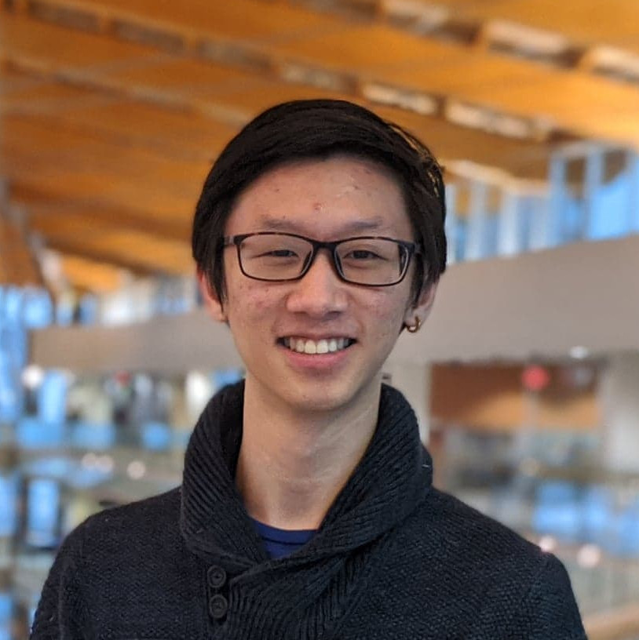

## Hi, I'm Jeffrey! 👋

I'm a **team-driving augmentation-inspired** software engineer with experience in product innovation and community leadership.

Previously, I've worked at SAP and Samsung and have been to 7 hackathons (and counting!). I've also worked on projects relating to:
- The Ugandan health care system
- COVID-19 relief initiative for struggling local healthcare workers and restaurants
- Mesh networks for disaster relief communication
- Mobile payment system infrastructure
- Virtual corporate engagement
- Healthcare patient information access

📖 **I'm currently reading:** Steve Jobs by Walter Isaacson, and A Song of Ice and Fire by G.R.R. Martin.

👪 **Looking to collaborate on:** Community-building initiatives!

❓ **Ask me about:** My hackathon projects and cyberpunk book recommendations!

🤝 **Connect with me on:**: [LinkedIn](https://www.linkedin.com/in/jleung51/), [Facebook](https://www.facebook.com/profile.php?id=1439766766)
